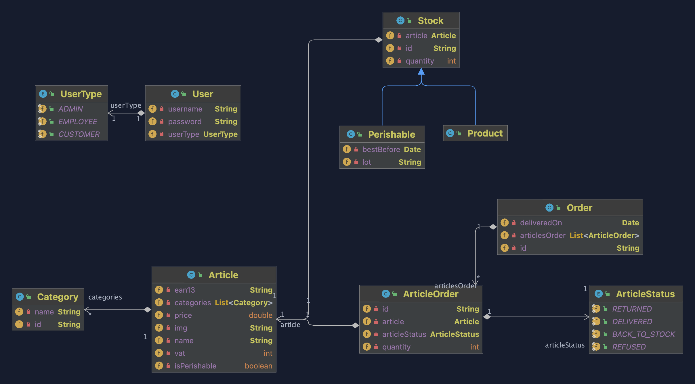
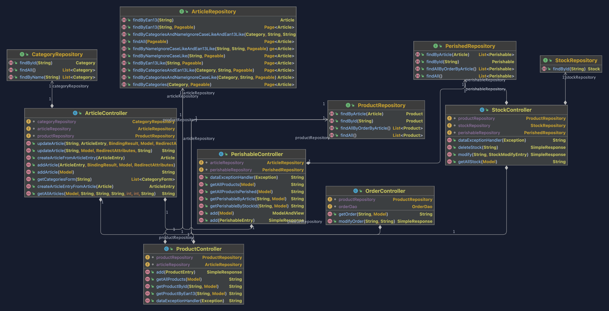

# Référencement de produit et stock

## Membres

- M'RABET EL KHOMSSI HATIM
- MICHOT JULIEN
- KOZLOV ANTOINE
- HOUAMED TAREK
- MEDAH Lisa

Le projet est disponible sur ce lien durant 5 jours

https://drop.chapril.org/download/5f4e2c1524fb1d36/#ccibb3LkTus8byfJ3DZD0A

## Diagrame UML

### Diagramme UML des models

### Diagramme UML des controllers

### Installation du projet

executer la commande depuis le source :
  
    mvn clean compile package
    
mettre le war generé dans le dossier webapps du serveur tomcat et executer.

### Choix de conception

Nous avons decidé d'utiliser une base de données H2 avec un fichier sql possedant une certaine base données.

